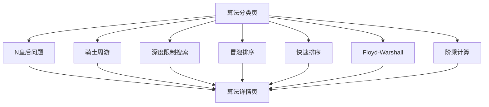

## 1. 产品概述
算法可视化教育平台，通过交互式动画展示经典算法的执行过程。帮助计算机科学学习者直观理解算法原理，提升学习效率。
- 目标用户：计算机科学学生、程序员、算法爱好者
- 核心价值：将抽象算法转化为可视化交互体验，降低学习门槛

## 2. 核心功能

### 2.1 用户角色
| 角色 | 注册方式 | 核心权限 |
|------|----------|----------|
| 访客用户 | 无需注册 | 浏览所有算法可视化、调整参数、控制动画播放 |
| 注册用户 | 邮箱注册 | 保存学习进度、收藏算法、参与评论讨论 |

### 2.2 功能模块
算法可视化平台包含以下核心页面：
1. **算法分类页**：展示算法分类网格，支持按类别筛选
2. **N皇后问题可视化页**：展示回溯算法解决N皇后问题的完整过程
3. **骑士周游可视化页**：演示骑士在棋盘上的周游路径搜索
4. **深度限制搜索可视化页**：展示深度限制搜索算法的执行过程
5. **冒泡排序可视化页**：动画演示冒泡排序的每一轮比较和交换
6. **快速排序可视化页**：展示分治思想的快速排序过程
7. **Floyd-Warshall可视化页**：演示多源最短路径算法的动态规划过程
8. **阶乘计算可视化页**：展示递归和迭代两种阶乘计算方式

### 2.3 页面详情
| 页面名称 | 模块名称 | 功能描述 |
|----------|----------|----------|
| 算法分类页 | 分类网格 | 展示7个算法的卡片式入口，支持分类筛选和搜索 |
| N皇后问题可视化页 | 棋盘可视化 | 绘制N×N棋盘，实时显示皇后放置位置和冲突检测 |
| N皇后问题可视化页 | 算法控制 | 提供步进、自动播放、速度调节、重置等控制功能 |
| N皇后问题可视化页 | 参数设置 | 支持调整棋盘大小N（4-12），选择不同的搜索策略 |
| 骑士周游可视化页 | 棋盘可视化 | 绘制8×8棋盘，显示骑士当前位置和已访问路径 |
| 骑士周游可视化页 | 路径搜索 | 演示Warnsdorff算法或其他启发式搜索过程 |
| 骑士周游可视化页 | 算法控制 | 支持单步执行、自动演示、暂停继续功能 |
| 深度限制搜索可视化页 | 树形可视化 | 展示搜索树的构建过程和深度限制的应用 |
| 深度限制搜索可视化页 | 节点状态 | 用不同颜色标识未访问、已访问、目标节点状态 |
| 冒泡排序可视化页 | 数组可视化 | 用柱状图或条形图展示待排序数组 |
| 冒泡排序可视化页 | 排序动画 | 高亮显示当前比较的元素和交换过程 |
| 冒泡排序可视化页 | 性能指标 | 实时显示比较次数、交换次数、时间复杂度 |
| 快速排序可视化页 | 分治可视化 | 展示递归调用栈和分区操作的可视化 |
| 快速排序可视化页 | 基准元素 | 突出显示pivot元素和分区边界 |
| 快速排序可视化页 | 算法分析 | 展示最佳、平均、最坏情况的时间复杂度 |
| Floyd-Warshall可视化页 | 矩阵可视化 | 展示距离矩阵的更新过程和中间节点 |
| Floyd-Warshall可视化页 | 路径重构 | 演示如何通过中间节点重构最短路径 |
| Floyd-Warshall可视化页 | 算法步骤 | 逐步展示三层循环的执行过程 |
| 阶乘计算可视化页 | 递归树 | 可视化递归调用的层次结构和返回值 |
| 阶乘计算可视化页 | 栈帧演示 | 展示函数调用栈的变化过程 |
| 阶乘计算可视化页 | 对比模式 | 同时展示递归和迭代两种实现方式 |

## 3. 核心流程

### 3.1 通用算法可视化流程
1. 用户选择算法类型和设置参数
2. 系统初始化可视化界面和数据结构
3. 用户控制算法执行（单步/自动/暂停/重置）
4. 实时更新可视化状态和算法指标
5. 完成后展示算法统计信息和复杂度分析

### 3.2 页面导航流程

## 4. 用户界面设计

### 4.1 设计风格
- **主色调**：深蓝色（#1e40af）配白色背景，营造专业科技感
- **强调色**：橙色（#f59e0b）用于高亮和重要操作按钮
- **按钮风格**：圆角矩形，3D阴影效果，hover状态有颜色变化
- **字体选择**：中文使用思源黑体，英文使用Inter，代码使用JetBrains Mono
- **布局风格**：卡片式布局，主要内容居中，控制面板置于底部或侧边
- **图标风格**：使用Lucide React图标库，线性风格，保持一致性

### 4.2 页面设计概述
| 页面名称 | 模块名称 | UI元素 |
|----------|----------|--------|
| 算法分类页 | 分类网格 | 响应式网格布局，每个算法卡片包含图标、标题、简短描述，悬停时有缩放动画效果 |
| N皇后问题可视化页 | 棋盘可视化 | 8×8网格棋盘，皇后用皇冠图标表示，冲突位置用红色高亮，支持拖拽放置 |
| 骑士周游可视化页 | 棋盘可视化 | 标准国际象棋棋盘，骑士用马形图标，已访问格子用渐变色标识 |
| 排序算法可视化页 | 数组可视化 | 垂直柱状图表示数组元素，高度对应数值大小，比较时用橙色高亮，交换时有平滑动画 |
| 图算法可视化页 | 矩阵/图可视化 | 邻接矩阵用热力图展示，图结构用节点和连线表示，路径用彩色高亮 |
| 递归算法可视化页 | 递归树 | 树形结构图，每个节点显示函数调用信息，递归深度用颜色深浅表示 |

### 4.3 响应式设计
- **桌面优先**：默认设计为桌面端，充分利用大屏幕空间
- **移动端适配**：平板和手机端采用响应式布局，控制面板折叠到顶部菜单
- **触摸优化**：移动端增大按钮尺寸，支持滑动手势控制动画速度
- **性能优化**：移动端降低动画帧率，减少粒子效果以保证流畅性