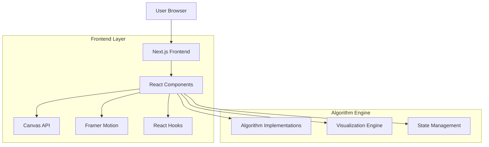

## 1. 架构设计



## 2. 技术栈描述

- **前端框架**: Next.js 14 + React 18
- **初始化工具**: create-next-app
- **样式方案**: Tailwind CSS + CSS Modules
- **动画库**: Framer Motion
- **可视化**: Canvas API + SVG
- **状态管理**: React Hooks (useState, useReducer)
- **国际化**: next-i18next
- **图标库**: Lucide React
- **代码高亮**: Prism.js
- **后端服务**: 无（纯前端应用）

## 3. 路由定义

| 路由 | 用途 |
|------|------|
| /[lang]/algorithms | 算法分类主页，展示所有算法入口 |
| /[lang]/algorithms/nqueens | N皇后问题可视化页面 |
| /[lang]/algorithms/knightstour | 骑士周游问题可视化页面 |
| /[lang]/algorithms/depthlimitedsearch | 深度限制搜索可视化页面 |
| /[lang]/algorithms/bubblesort | 冒泡排序可视化页面 |
| /[lang]/algorithms/quicksort | 快速排序可视化页面 |
| /[lang]/algorithms/floydwarshall | Floyd-Warshall算法可视化页面 |
| /[lang]/algorithms/factorial | 阶乘计算可视化页面 |

## 4. 核心组件架构

### 4.1 通用可视化组件
```typescript
interface VisualizationProps {
  lang: string;
  algorithm: string;
  onStepChange?: (step: number) => void;
  onComplete?: (stats: AlgorithmStats) => void;
}

interface AlgorithmStats {
  steps: number;
  comparisons: number;
  swaps: number;
  timeComplexity: string;
  spaceComplexity: string;
}

interface ControlPanelProps {
  isPlaying: boolean;
  speed: number;
  onPlay: () => void;
  onPause: () => void;
  onReset: () => void;
  onSpeedChange: (speed: number) => void;
  onStep: () => void;
}
```

### 4.2 算法状态管理
```typescript
interface AlgorithmState {
  currentStep: number;
  totalSteps: number;
  data: any[];
  animations: AnimationStep[];
  isPlaying: boolean;
  speed: number; // 1-10
  stats: {
    comparisons: number;
    swaps: number;
    recursiveCalls: number;
  };
}

interface AnimationStep {
  type: 'compare' | 'swap' | 'highlight' | 'move';
  indices: number[];
  values?: any[];
  description: string;
}
```

## 5. 算法实现架构

### 5.1 可视化引擎
```typescript
class VisualizationEngine {
  private canvas: HTMLCanvasElement;
  private ctx: CanvasRenderingContext2D;
  private animationQueue: AnimationStep[];
  
  constructor(canvas: HTMLCanvasElement) {
    this.canvas = canvas;
    this.ctx = canvas.getContext('2d');
    this.animationQueue = [];
  }
  
  drawArray(data: number[], highlights: number[] = []): void;
  drawChessBoard(size: number, queens: Position[]): void;
  drawGraph(nodes: Node[], edges: Edge[]): void;
  animateStep(step: AnimationStep, duration: number): Promise<void>;
}
```

### 5.2 算法包装器
```typescript
abstract class AlgorithmVisualizer {
  protected data: any[];
  protected steps: AnimationStep[] = [];
  protected currentStep: number = 0;
  
  abstract initialize(data: any[]): void;
  abstract step(): AnimationStep | null;
  abstract reset(): void;
  abstract getStats(): AlgorithmStats;
  
  protected recordStep(type: string, data: any): void {
    this.steps.push({
      type: type as AnimationType,
      data: JSON.parse(JSON.stringify(data)),
      timestamp: Date.now()
    });
  }
}
```

## 6. 性能优化策略

### 6.1 渲染优化
- **Canvas双缓冲**: 使用离屏canvas减少重绘闪烁
- **动画节流**: 根据算法复杂度动态调整动画帧率
- **分层渲染**: 静态背景和动态元素分离渲染
- **Web Worker**: 复杂计算移至Worker线程

### 6.2 内存管理
- **对象池**: 复用动画对象避免频繁GC
- **虚拟化**: 大数据集采用虚拟滚动
- **懒加载**: 算法代码按需加载
- **缓存策略**: 缓存已计算的中间结果

### 6.3 响应式设计
```typescript
const ResponsiveVisualization = {
  mobile: {
    canvasSize: { width: 320, height: 240 },
    animationFPS: 30,
    showDetails: false
  },
  tablet: {
    canvasSize: { width: 768, height: 480 },
    animationFPS: 45,
    showDetails: true
  },
  desktop: {
    canvasSize: { width: 1024, height: 640 },
    animationFPS: 60,
    showDetails: true
  }
};
```

## 7. 国际化支持

### 7.1 字典结构
```json
{
  "algorithms": {
    "nqueens": {
      "title": "N皇后问题",
      "description": "使用回溯算法解决N皇后问题",
      "controls": {
        "play": "播放",
        "pause": "暂停",
        "reset": "重置",
        "step": "单步",
        "speed": "速度"
      },
      "parameters": {
        "boardSize": "棋盘大小",
        "algorithm": "算法选择"
      }
    }
  }
}
```

### 7.2 动态加载
```typescript
const loadAlgorithmI18n = async (lang: string, algorithm: string) => {
  const dictionary = await import(`@/dictionaries/${lang}.json`);
  return dictionary.algorithms[algorithm];
};
```

## 8. 测试策略

### 8.1 单元测试
- **算法正确性**: 验证每个算法的逻辑正确性
- **可视化一致性**: 确保动画步骤与算法状态同步
- **性能基准**: 测试大数据集下的渲染性能

### 8.2 集成测试
- **跨浏览器兼容**: Chrome, Firefox, Safari, Edge
- **移动端适配**: iOS Safari, Android Chrome
- **无障碍访问**: 键盘导航、屏幕阅读器支持

## 9. 部署配置

### 9.1 Next.js配置
```javascript
// next.config.js
module.exports = {
  i18n: {
    locales: ['zh', 'en'],
    defaultLocale: 'zh',
  },
  images: {
    domains: ['gallery.selfboot.cn'],
  },
  experimental: {
    appDir: true,
  },
};
```

### 9.2 构建优化
- **代码分割**: 按算法和语言分包
- **预加载**: 关键资源预加载
- **缓存策略**: 静态资源长期缓存
- **CDN配置**: 全球分发加速