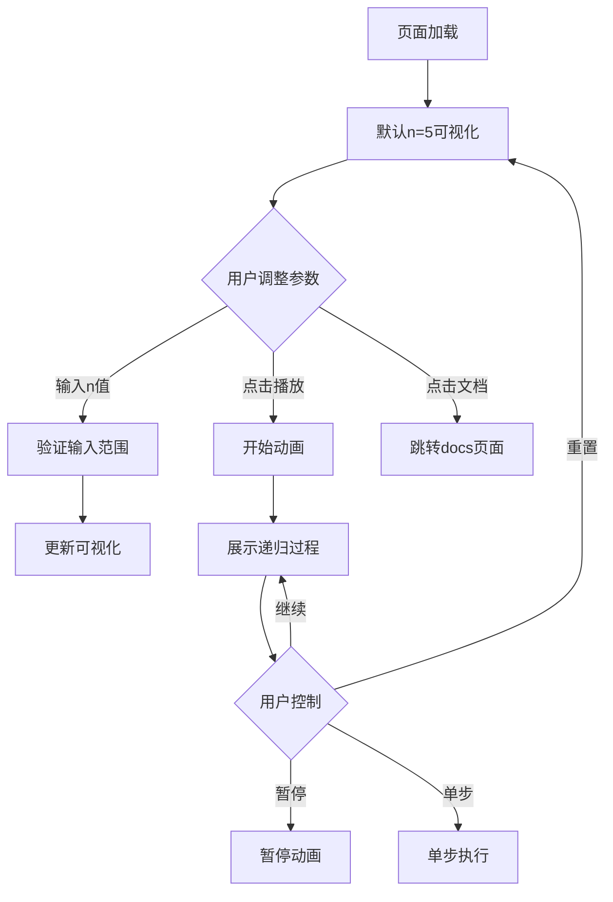

## 1. 产品概述
阶乘算法可视化页面是一个交互式学习工具，通过Canvas动画和递归树展示帮助用户直观理解阶乘算法的执行过程。该页面专为算法学习者和编程初学者设计，通过可视化手段降低递归概念的理解门槛。

目标市场：编程教育平台、算法学习网站、计算机科学教学辅助工具。

## 2. 核心功能

### 2.1 用户角色
| 角色 | 注册方式 | 核心权限 |
|------|----------|----------|
| 访客用户 | 无需注册 | 浏览和使用可视化功能、调整参数、控制动画 |
| 注册用户 | 邮箱注册 | 保存学习进度、添加笔记、参与评论讨论 |

### 2.2 功能模块
阶乘算法可视化页面包含以下核心模块：
1. **可视化主界面**：Canvas绘图区域展示递归过程动画
2. **控制面板**：参数调节、播放控制、速度调节
3. **文档入口**：右上角"View Docs"按钮跳转详细文档
4. **评论区域**：用户讨论和反馈

### 2.3 页面详情
| 页面名称 | 模块名称 | 功能描述 |
|----------|----------|----------|
| 阶乘可视化页 | PageHeader | 显示页面标题和导航，集成docsPathname属性提供文档入口 |
| 阶乘可视化页 | Canvas绘图区 | 2:1响应式布局左侧，展示递归树、调用栈、计算过程动画 |
| 阶乘可视化页 | 控制面板 | 2:1响应式布局右侧，包含输入框、播放/暂停、速度调节、步骤显示 |
| 阶乘可视化页 | 参数输入 | 数字输入框设置n值，支持1-20范围，实时验证 |
| 阶乘可视化页 | 动画控制 | 播放、暂停、重置、单步执行、速度滑块 |
| 阶乘可视化页 | 信息显示 | 当前步骤描述、调用栈状态、计算结果展示 |
| 阶乘可视化页 | 评论组件 | 用户评论、问题讨论、学习心得分享 |

## 3. 核心流程
用户操作流程：
1. 用户访问阶乘算法页面，自动加载默认参数(n=5)的可视化
2. 用户可通过输入框调整n值(1-20)，系统实时验证输入有效性
3. 点击播放按钮开始动画，Canvas展示递归调用树构建过程
4. 动画显示函数调用、参数传递、返回值计算等关键步骤
5. 用户可随时暂停、单步执行或调节播放速度
6. 右上角"View Docs"按钮可跳转到详细文档页面

## 4. 用户界面设计

### 4.1 设计风格
- **主色调**：深蓝色(#1e40af)作为主色，橙色(#f97316)作为强调色
- **按钮样式**：圆角矩形，hover状态有明显颜色变化，3D阴影效果
- **字体选择**：Inter字体族，标题24px，正文16px，代码14px
- **布局风格**：卡片式布局，左侧Canvas区域，右侧控制面板
- **图标风格**：使用Lucide React图标库，线性图标风格，统一2px线宽

### 4.2 页面设计概述
| 页面名称 | 模块名称 | UI元素 |
|----------|----------|--------|
| 阶乘可视化页 | Canvas绘图区 | 深色主题背景(#1f2937)，递归树节点使用渐变色，当前激活节点橙色高亮，连接线使用平滑贝塞尔曲线 |
| 阶乘可视化页 | 控制面板 | 白色卡片背景，圆角边框，内边距24px，输入框带图标前缀，按钮采用主色调渐变 |
| 阶乘可视化页 | 参数输入 | 数字输入框带上下调节按钮，输入无效时边框变红显示错误提示 |
| 阶乘可视化页 | 动画控制 | 播放控制按钮组采用图标按钮，速度滑块带实时数值显示，整体居中排列 |
| 阶乘可视化页 | 信息显示 | 使用代码块样式展示调用栈，语法高亮，当前步骤使用箭头指示 |

### 4.3 响应式设计
- **桌面优先**：默认1440px宽度设计，支持1366px-1920px范围
- **平板适配**：768px-1024px范围，调整为上下布局，Canvas在上控制面板在下
- **移动端**：375px-767px范围，采用垂直堆叠，简化控制面板为折叠式
- **触摸优化**：按钮最小44px点击区域，滑块支持触摸拖拽操作