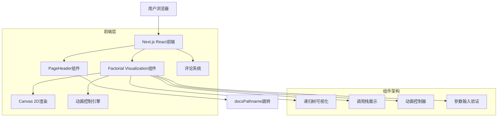
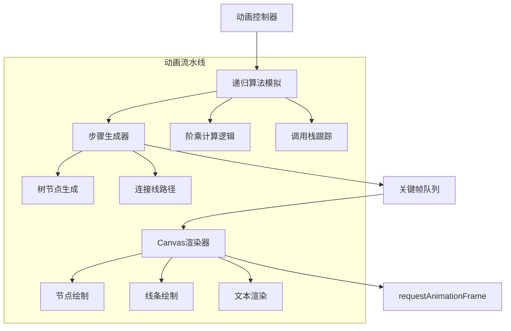

## 1. 架构设计



## 2. 技术描述

- **前端框架**: Next.js 14 + React 18 + TypeScript
- **样式方案**: Tailwind CSS 3 + CSS Modules
- **Canvas渲染**: HTML5 Canvas 2D API + requestAnimationFrame
- **图标库**: Lucide React
- **国际化**: next-i18next
- **构建工具**: Next.js内置构建系统
- **后端**: 无，纯前端实现

## 3. 路由定义

| 路由 | 用途 |
|------|------|
| `/[lang]/algorithms/factorial` | 阶乘算法可视化主页面 |
| `/[lang]/algorithms/factorial/docs` | 阶乘算法详细文档页面 |

## 4. 组件架构

### 4.1 页面组件结构
```typescript
// page.js - 主页面组件
interface FactorialPageProps {
  params: {
    lang: string;
  };
}
```

### 4.2 可视化组件接口
```typescript
// content.js - 可视化核心组件
interface VisualizationProps {
  lang: string;
}

interface AnimationState {
  n: number;
  currentStep: number;
  isPlaying: boolean;
  speed: number;
  callStack: CallFrame[];
}

interface CallFrame {
  functionName: string;
  params: any[];
  returnValue?: any;
  lineNumber: number;
}
```

### 4.3 Canvas渲染接口
```typescript
interface TreeNode {
  id: string;
  value: number;
  x: number;
  y: number;
  radius: number;
  color: string;
  children: TreeNode[];
  parent?: TreeNode;
  state: 'pending' | 'active' | 'completed';
}

interface AnimationFrame {
  nodes: TreeNode[];
  connections: Connection[];
  activeNodeId?: string;
}
```

## 5. 动画引擎架构



## 6. 核心算法实现

### 6.1 阶乘递归模拟
```typescript
function* factorialGenerator(n: number): Generator<AnimationStep, number, void> {
  const steps: AnimationStep[] = [];
  
  function factorial(x: number, depth: number): number {
    // 生成进入函数步骤
    yield {
      type: 'enter',
      functionName: 'factorial',
      params: [x],
      depth: depth,
      lineNumber: 1
    };
    
    if (x <= 1) {
      // 基础情况
      yield {
        type: 'base_case',
        value: 1,
        depth: depth
      };
      return 1;
    }
    
    // 递归调用
    const result = x * factorial(x - 1, depth + 1);
    
    yield {
      type: 'return',
      value: result,
      depth: depth
    };
    
    return result;
  }
  
  return factorial(n, 0);
}
```

### 6.2 Canvas渲染优化
```typescript
class TreeRenderer {
  private canvas: HTMLCanvasElement;
  private ctx: CanvasRenderingContext2D;
  private animationQueue: AnimationFrame[];
  
  constructor(canvas: HTMLCanvasElement) {
    this.canvas = canvas;
    this.ctx = canvas.getContext('2d');
    this.animationQueue = [];
  }
  
  renderNode(node: TreeNode): void {
    const { ctx } = this;
    
    // 绘制节点圆形
    ctx.beginPath();
    ctx.arc(node.x, node.y, node.radius, 0, 2 * Math.PI);
    ctx.fillStyle = node.color;
    ctx.fill();
    ctx.strokeStyle = this.getNodeBorderColor(node.state);
    ctx.lineWidth = 3;
    ctx.stroke();
    
    // 绘制节点文本
    ctx.fillStyle = '#ffffff';
    ctx.font = '16px Inter';
    ctx.textAlign = 'center';
    ctx.textBaseline = 'middle';
    ctx.fillText(node.value.toString(), node.x, node.y);
  }
  
  renderConnection(parent: TreeNode, child: TreeNode): void {
    const { ctx } = this;
    
    ctx.beginPath();
    ctx.moveTo(parent.x, parent.y + parent.radius);
    
    // 使用贝塞尔曲线绘制平滑连接线
    const controlX = (parent.x + child.x) / 2;
    const controlY = (parent.y + child.y) / 2 + 20;
    
    ctx.quadraticCurveTo(controlX, controlY, child.x, child.y - child.radius);
    ctx.strokeStyle = '#6b7280';
    ctx.lineWidth = 2;
    ctx.stroke();
  }
}
```

## 7. 性能优化策略

### 7.1 渲染优化
- **脏矩形检测**: 只重绘发生变化的区域
- **对象池**: 重用TreeNode对象避免频繁创建销毁
- **离屏Canvas**: 复杂图形预渲染到离屏Canvas
- **动画节流**: 根据设备性能动态调整帧率

### 7.2 内存管理
- **自动清理**: 动画完成后自动清理事件监听器和定时器
- **防抖处理**: 参数输入使用防抖避免频繁重新计算
- **渐进式渲染**: 大数据集采用分批渲染策略

## 8. 响应式布局实现

```typescript
// 2:1响应式布局计算
function calculateLayout(containerWidth: number, containerHeight: number) {
  const isMobile = containerWidth < 768;
  
  if (isMobile) {
    // 移动端垂直布局
    return {
      canvasHeight: containerHeight * 0.6,
      controlHeight: containerHeight * 0.4,
      canvasWidth: containerWidth,
      controlWidth: containerWidth
    };
  } else {
    // 桌面端2:1水平布局
    return {
      canvasHeight: containerHeight,
      controlHeight: containerHeight,
      canvasWidth: containerWidth * 0.67,
      controlWidth: containerWidth * 0.33
    };
  }
}
```